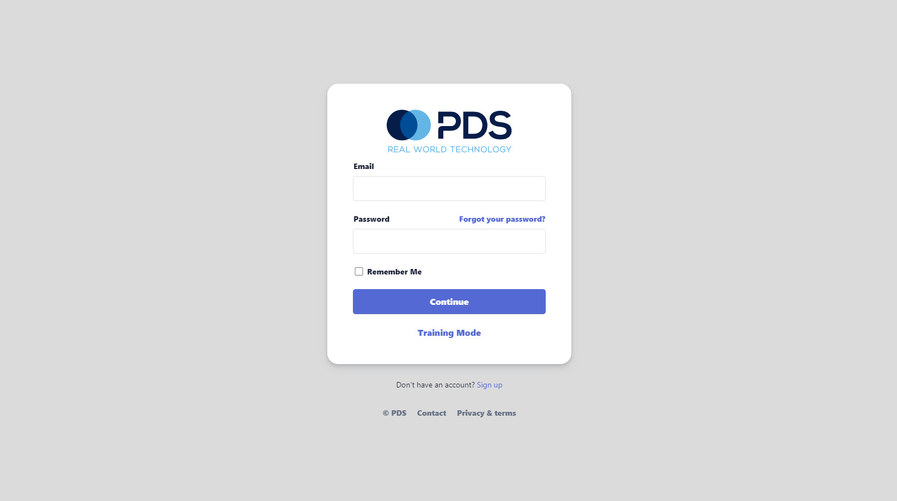
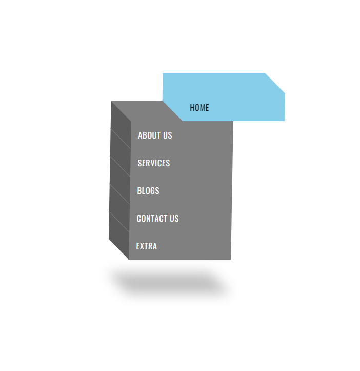

# UI-Collection
A collection of user interface build as part of work that didn't make it to production.

## Text-Opacity-on-Scroll
<h2> Text Opacity on Scrolling animation found on airpods pro 2 page near the top.
Currently opacity changing from 0.2 to 1 works when scrolling down.
Currently opacity chagning from 1 to 0.2 works ONLY when scrolling up.
Opacity changing from 1 to 0.2 to text doesn't work when scrolling down.
Edit: Scrolled text opacity now returns to 0.1
Used Intersection observer API.<h2/>
 

## Animated Login Form
- A login form for our new PDSX project
  

## 3D-navbar 
### Prototype, one design that didn't make the final design for a client. This is not webGL, feel free to use it.
### See it live on  

   

